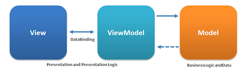

# Vue.js

## 서론 

- 네이버 Hackday Cloud Picker라는 좋은 기회를 계기로 Vue를 공부하게 되었다. 
- 목표는 Hackday 전까지 구조를 이해하고, cli혹은 스스로(...) 간단하게 Vue를 이용한 서비스 개발
- 가능하면 file upload 연동 
- 나름대로 Vue를 공부한 것을 정리하기 위한 문서. 1-2일 정도 소요 되었습니다...
 

## What is vue?
-----------------------
- 프론트엔드 자바스크립트 프레임워크(by. Ecan You/ MIT License!)이다
- 이름 그대로 View에 최적화 되어있음. 컨트롤러 대신 View를 가지는 MVVM 패턴 기반 디자인!
- Anguler, React에 비해 매우 작고 가벼움. 복잡도도 낮다!(좋은데?)
- 뷰는 CDN으로 사용하기에도 너무나 간편한 것! (원한다면 webpack 사용가능)
- 사용자 인터페이스를 만들기 위한 진보적 framework

## vue 특징
--------------------
- 가상 DOM 사용
- React보다 성능 빠름
- Template 사용
- 서버사이드 렌더링

## MVVM 패턴

- 뷰 관련 옵션 : el, template
- 데이터 관련 옵션 : data, methods, computed
- 컴포넌트 관련 옵션 : components
- 생명 주기 훅 : created, mounted, updated, destroyed

 

## vue 사용기

- React의 props와 비슷한 구성이 존재! 
- one-way & two-way binding 지원 

### Directive(지시문)

- Vue 만의 특별한 속성
- Element의 동작을 지시하는 역할 
- "v-"라는 prefix를 가짐 
